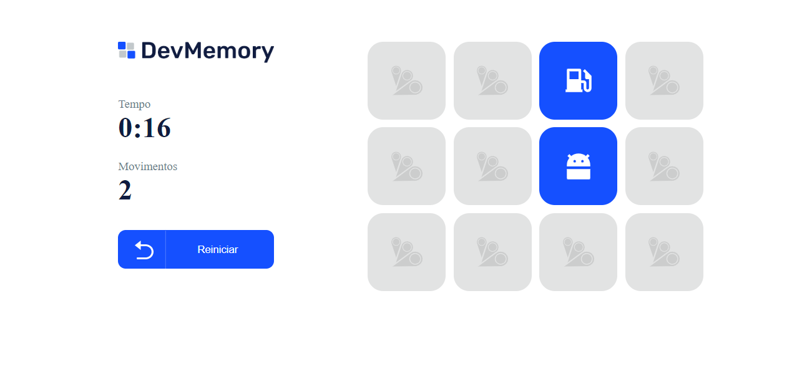

# Jogo-da-memoria-react
Projeto de um jogo da memoria com 12 itens, esse projeto foi desenvolvido em parceria com a B7web e seu curso de React.Js assim aprofundando o nosso conhecimento na tecnologia React.Js e suas mudanças de states.

 
 
## Iniciando o projeto:

**1 - Adicione a pasta node_modules com o comando:**
- npm install

**2 - Iniciando aplicação:**
- Use o comando 'npm start' para iniciar a aplicação!
